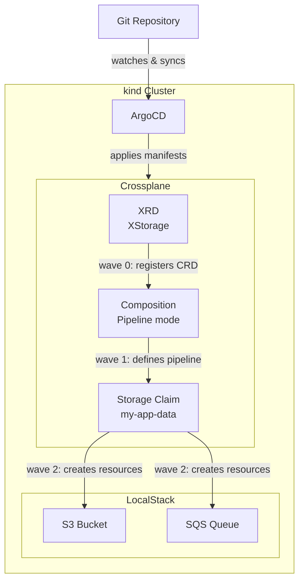

# AWS Crossplane LocalStack GitOps

This project demonstrates a **GitOps workflow** using ArgoCD, Crossplane, and LocalStack on a local Kubernetes cluster (kind). Infrastructure is defined as code and automatically reconciled from a Git repository — no manual `kubectl apply` needed after initial setup.

## Architecture



## Tech Stack

| Tool | Version | Purpose |
|---|---|---|
| [kind](https://kind.sigs.k8s.io/) | v0.20+ | Local Kubernetes cluster |
| [ArgoCD](https://argoproj.github.io/cd/) | stable | GitOps continuous delivery |
| [Crossplane](https://crossplane.io/) | v2.2.0 | Infrastructure as Code via Kubernetes |
| [LocalStack](https://localstack.cloud/) | latest | Local AWS services emulator |
| upbound/provider-aws-s3 | v1.0.0 | Crossplane AWS S3 provider |
| upbound/provider-aws-sqs | v1.0.0 | Crossplane AWS SQS provider |

## Project Structure

```
.
├── Makefile                                  # Automation commands
├── k8s-cluster/
│   └── kind-config.yaml                      # kind cluster config
└── infrastructure/
    ├── argocd/
    │   └── infra-app.yaml                    # ArgoCD Application
    ├── crossplane/
    │   ├── provider-aws.yaml                 # Providers + Function
    │   ├── provider-config.yaml              # ProviderConfig + Secret
    │   ├── s3-bucket.yaml                    # Standalone S3 bucket
    │   ├── definitions/
    │   │   └── storage-definition.yaml       # XRD (CompositeResourceDefinition)
    │   ├── compositions/
    │   │   └── storage-composition.yaml      # Composition (Pipeline mode)
    │   └── claims/
    │       └── my-app-storage.yaml           # Storage Claim
    └── localstack/
        ├── namespace.yaml
        ├── deployment.yaml
        └── service.yaml
```

## GitOps Flow

```
Developer pushes to Git
        │
        ▼
ArgoCD detects changes (polls every 3 min or webhook)
        │
        ▼
ArgoCD syncs manifests to cluster (respecting sync-waves)
        │
        ├── Wave 0: XRD (registers Storage CRD)
        ├── Wave 1: Composition (defines how to create resources)
        └── Wave 2: Storage Claim → Crossplane creates S3 + SQS in LocalStack
```

## Prerequisites

- Docker
- [kind](https://kind.sigs.k8s.io/docs/user/quick-start/#installation)
- [kubectl](https://kubernetes.io/docs/tasks/tools/)
- [helm](https://helm.sh/docs/intro/install/)
- [argocd CLI](https://argo-cd.readthedocs.io/en/stable/cli_installation/)

## Quick Start

```bash
# 1. Clone the repo
git clone https://github.com/gnegn/aws-crossplane-localstack-gitops.git
cd aws-crossplane-localstack-gitops

# 2. Full setup (cluster + localstack + argocd + crossplane)
make setup

# 3. Open ArgoCD UI
make argocd-ui
# → http://localhost:8080

# 4. Check everything is running
make status

# 5. Verify AWS resources in LocalStack
make check-buckets
make check-queues
```

## Available Make Commands

```bash
make setup            # Full setup from scratch
make setup-cluster    # Create kind cluster only
make setup-localstack # Deploy LocalStack into cluster
make setup-argocd     # Install ArgoCD + apply Application
make setup-crossplane # Install Crossplane via Helm
make status           # Show status of all components
make check-buckets    # List S3 buckets in LocalStack
make check-queues     # List SQS queues in LocalStack
make argocd-ui        # Port-forward ArgoCD UI to :8080
make sync             # Force ArgoCD sync
make logs             # Show logs for Crossplane + LocalStack
make destroy          # Delete the kind cluster
```

## Key Concepts Demonstrated

**GitOps** — the Git repository is the single source of truth. Any change to infrastructure is made via a pull request, not manual commands.

**Crossplane Compositions** — instead of managing raw AWS resources, a developer creates a simple `Storage` claim and Crossplane handles creating the S3 bucket and SQS queue together, using the Pipeline mode with `function-patch-and-transform`.

**ArgoCD Sync Waves** — since `Storage` claims depend on the XRD CRD being registered first, sync waves ensure correct ordering: XRD → Composition → Claim.

**LocalStack** — all AWS services run locally inside the Kubernetes cluster, making this project fully reproducible without an AWS account.

## Troubleshooting

**Storage claim stuck in `READY: False`**
```bash
kubectl describe xstorage
# Check for "cannot select Composition" → Composition may not be deployed yet
argocd app sync crossplane-resources
```

**ArgoCD not picking up subdirectory changes**
```bash
# Ensure infra-app.yaml has directory.recurse: true
argocd app get crossplane-resources --hard-refresh
```

**Crossplane provider health degraded**
```bash
kubectl get providers
kubectl describe provider provider-aws-s3
# Check endpoint URL in provider-config.yaml points to localstack service
```